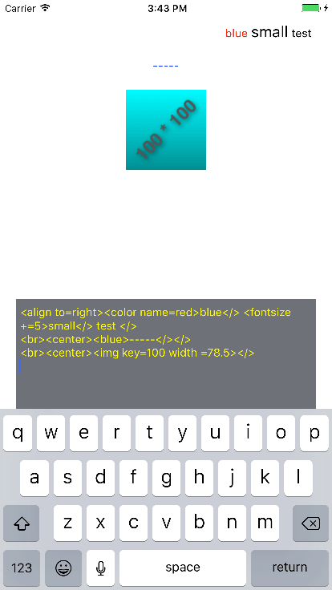

# TextFormater
a pod to convert String to NSAttributedString

[](https://travis-ci.org/1Fr3dG/TextFormater)
[](http://cocoapods.org/pods/TextFormater)
[](http://cocoapods.org/pods/TextFormater)
[](http://cocoapods.org/pods/TextFormater)

用来将包含格式化命令的纯文本字符串转换为格式字符串。主要设计用于 Label、Button 和小型文本框。大型页面可以直接使用 `NSAttributedString.init(html:documentAttributes:)`来实现。

Convert a string with format commands to NSAttributedString. This is designed for Label\Button\small TextView. `NSAttributedString.init(html:documentAttributes:)` should be better choice for a big page.

## Example

可以运行样例 app 来测试不同格式命令的效果。

The example project can be used to test format commands.

To run the example project, clone the repo, and run `pod install` from the Example directory first.

* iOS Demp App



* OSX Demo App


## Requirements

* iOS 9.0
* OSX 10.12

## Installation

TextFormater 可通过[CocoaPods](http://cocoapods.org)安装：

TextFormater is available through [CocoaPods](http://cocoapods.org). To install
it, simply add the following line to your Podfile:

```ruby
pod "TextFormater"
```

## Usage - 用法

* 实现图片数据获取代理
* Conform protocol GetImageForTextFormater

```swift
func getImage(byKey: String) -> UIImage? {
        switch byKey {
        case "50":
            return #imageLiteral(resourceName: "img50")
        default:
            return nil
        }
```

* 获取格式化对象实例
* Get formater variable

```swift
let textFormater = TextFormater()
textFormater.imageDelegate = self
```
* 使用格式化器格式化字符串
* Format string by it

```swift
textResult.attributedText = textFormater.format(textCode.text)
```

## Customization - 定制化

以下属性和方法用于改变格式化器的行为

Following could be used to change the default behavior of textFormater

### defaultFormat

* 缺省格式前缀, 将附加在所有格式文本之前

* Default prefix, will be added to any string before formating

### dynamicFormat

* 动态格式前缀，将附加在所有格式文本之前，defaultFormat 之后
	* 用于 traitCollectionDidChange 等情况调整格式化参数
* Dynamic prefix, will be added to string, after defaultFormat
	* Deisgned to adjust format according changes like traitCollectionDidChange

### imageDelegate

* 图片获取代理
* Deletate for image (used for img command)

### func setFont(name: String, font: UIFont)

* 设置定制化字体
* set customized font

### normalFontSize

* 标准字号
* Default size of font

### func setColor(name: String, color: UIColor)

* 设置定制化颜色
* set customized color


## Commands - 格式命令

### 断字符 - enclosure
格式化命令用`<>`包含，如有必要可修改`_cs``_ce`来更换断字符。

Format command was enclosed by `<>`. Which can be changed to other character by set member `_cs``_ce`.

### 参数 - parameter
参数名和数值用`=`连接，不能有空格，引号不起作用

Parameter key and value combined with `=`, without any space.

### 作用域 - scope
命令的效果可以叠加

Scope of commands can be overlapped.

### 命令结束 - end of a command
`</>`命令用于结束前一个效果

Use `</>` to end the effect of a command

* 并不要求所以效果命令用`</>`配对，字符串分析达到结尾时结束。
* It is NOT required to enclose every command with `</>`.

---

### `<br>`
换行。该命令不需要结束 (`</>`)。

New line. No closure (`</>`) to this command.

### `</>`
命令效果结束。

End of last command effect.

### ``
插入图片。该命令不需要结束 (`</>`)。

Insert an image. No closure (`</>`) to this command.

* key: String
	* 用于从 `imageDelegate.getImage(byKey: key)` 获取图像
	* Used to get image by `imageDelegate.getImage(byKey: key)`
* width: CGFloat
	* 设为0则使用图像原始宽高，`height`将被忽略
	* Use image.size if set width to 0, note height will be ignored
* height: CGFloat
	* 不设置`height`则按照`width`进行等比缩放
	* With `height` not setted, image will be aspect resized by `width`

### `<align to=left|center|right>`
#### 快捷命令-Shotcut: `<left>``<center>``<right>`

水平对齐方式。

Line alignment.

* 该命令必须在一行的最开始(紧跟`<br>`没有空格)
* This command must be used at the begining of new line (follow a `<br>` without space)

### `<font name= size= >` *一般不应使用-SHOULD NOT USE NORMALLY*
使用系统字体。

Set font to a system font.

* name: String
	* 系统字体名
	* Name of an available font
* size: Int

### `<fontname>`
#### 快捷命令-Shotcut: `<b>` = `<boldfont>`; `<i>` = `<italicfont>`
使用 `TextFormater.fonts` 字典设置字体。本命令**不影响**字体大小。

Set font to a font in dictionary `TextFormater.fonts`. This command will **NOT** affect font size.

缺省有 `normalfont` `boldfont` `italicfont`，使用 `setFont` 方法设置

There are `normalfont` `boldfont` `italicfont` by default. Can be added/modified by `setFont` member function.

#### 注意 - Note
应使用`</>`结束字体效果，而不是`<normalfont>`

Use `</>` to end a font effect, `<normalfont>` is **NOT** for that purpose.

### `<fontsize += >`, `<fontsize -= >`
调整字体相对大小。

Adjust font size relevantly.

* `<fontsize +=0>`/`<fontsize -=0`> 将把字体设置为标准大小 (`normalFontSize`)
* `<fontsize +=0>`/`<fontsize -=0`> will set font size to default size: (`normalFontSize`)

* 将字体大小强制设为数值可使用 `<font size= >` 命令
* Set font size to direct number could use `<font size= >`

### `<color name=clear|black|blue|red|green|yellow|...>`
#### 快捷命令-Shotcut: `<colorname>`
设置前景色。

Set foreground color.

* 颜色来自于 `colors` 词典，可以用 `setColor` 添加
* Color name from `colors` dictionary, new color can be added by `setColor` member function

### `<bgcolor name=clear|black|blue|red|green|yellow|...>`

设置背景色。

Set background color.

* 颜色来自于 `colors` 词典，可以用 `setColor` 添加
* Color name from `colors` dictionary, new color can be added by `setColor` member function

## Author

[Alfred Gao](http://alfredg.org), [alfredg@alfredg.cn](mailto:alfredg@alfredg.cn)

## License

TextFormater is available under the MIT license. See the LICENSE file for more info.
