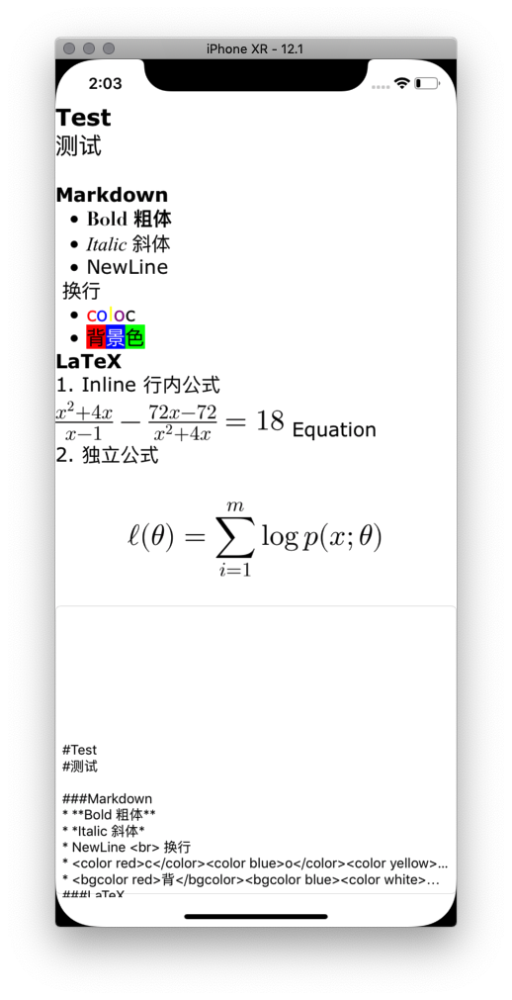
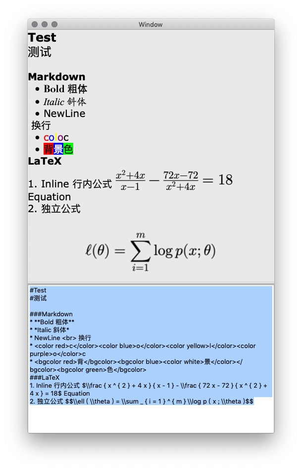

# TextFormater
a pod to convert String to NSAttributedString

[](https://travis-ci.org/1Fr3dG/TextFormater)
[](http://cocoapods.org/pods/TextFormater)
[](http://cocoapods.org/pods/TextFormater)
[](http://cocoapods.org/pods/TextFormater)

用来将包含格式化命令的纯文本字符串转换为格式字符串。主要设计用于 Label、Button 和小型文本框。大型页面可以直接使用 `NSAttributedString.init(html:documentAttributes:)`来实现。

Convert a string with format commands to NSAttributedString. This is designed for Label\Button\small TextView. `NSAttributedString.init(html:documentAttributes:)` should be better choice for a big page.

## Thanks
新版实现基于[MarkdownKit](https://cocoapods.org/pods/MarkdownKit)和[iosMath](https://cocoapods.org/pods/iosMath)实现

New 2.0 version is built based on [MarkdownKit](https://cocoapods.org/pods/MarkdownKit) and [iosMath](https://cocoapods.org/pods/iosMath)

## Example

可以运行样例 app 来测试不同格式命令的效果。

The example project can be used to test format commands.

To run the example project, clone the repo, and run `pod install` from the Example directory first.

* iOS Demp App



* OSX Demo App



## Requirements

* iOS 11.0
* OSX 10.13

## Installation

TextFormater 可通过[CocoaPods](http://cocoapods.org)安装：

TextFormater is available through [CocoaPods](http://cocoapods.org). To install
it, simply add the following line to your Podfile:

**注意** iosMath 需要最新版，可使用github版本

**Note** New version of iosMath is required

```ruby
pod 'iosMath', :git => 'https://github.com/kostub/iosMath.git'
pod "TextFormater"
```

## Usage - 用法

* 实现图片数据获取代理
* Conform protocol GetImageForTextFormater

```swift
func getImage(byKey: String) -> UIImage? {
        switch byKey {
        case "50":
            return #imageLiteral(resourceName: "img50")
        default:
            return nil
        }
```

* 获取格式化对象实例
* Get formater variable

```swift
let textFormater = TextFormater()
textFormater.imageDelegate = self
```
* 使用格式化器格式化字符串
* Format string by it

```swift
textResult.attributedText = textFormater.parse(textCode.text)
```

## Customization - 定制化

在创建对象时可设置字体

It is recommanded to customize fonts during init()

```swift
public init(fontFamilies:[String] = ["Verdana","苹方-简"],
                fontSize:CGFloat = 0,
                color:MarkdownColor = MarkdownParser.defaultColor,
                boldFontFamilies:[String] = ["Didot","Hei"],
                boldFontSize:CGFloat = 0,
                boldFontColor:MarkdownColor = MarkdownParser.defaultColor,
                italicFontFamilies:[String] = ["Times New Roman","Kai"],
                italicFontSize:CGFloat = 0,
                italicFontColor:MarkdownColor = MarkdownParser.defaultColor,
                equationFontSize:CGFloat = 0,
                equationColor:MarkdownColor = MarkdownParser.defaultColor,
                imageDelegate:GetImageForTextFormater = NilImageDelegate()
        )
```

### imageDelegate

* 必须提供图片获取代理
* Must provide deletater for image (used for img command)


## Commands - 格式命令

### 命令嵌套 - nest
不支持同一命令嵌套使用

It is not supported to nest same command

---

### `<br>`
换行。该命令不需要结束 (`</>`)。

New line. No closure (`</>`) to this command.

### `key</img>`
插入图片。

Insert an image. 

### `<center>.*</center>`

居中。自动在首尾增加两个换行(`\n`)

Center alignment. Newline (`\n`) added to head and tail.

### `<color black|blue|red|green|yellow|...>.*</color>`
设置前景色。

Set foreground color.


### `<bgcolor black|blue|red|green|yellow|...>.*</bgcolor>`

设置背景色。

Set background color.

### `$equation$`
行内模式数学公式。
LaTeX equation in text mode.

### `$$equation$$`
单行居中数学公式。
LaTeX equation in display mode.


## Author

[Alfred Gao](http://alfredg.org), [alfredg@alfredg.cn](mailto:alfredg@alfredg.cn)

## License

TextFormater is available under the MIT license. See the LICENSE file for more info.
